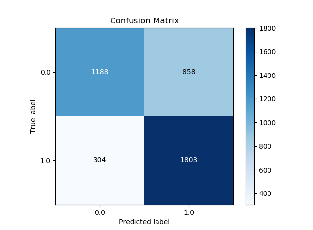
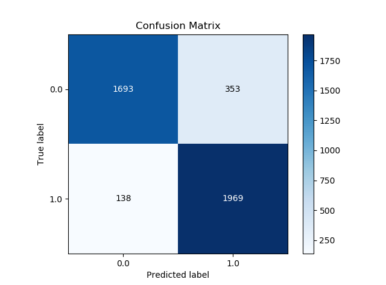
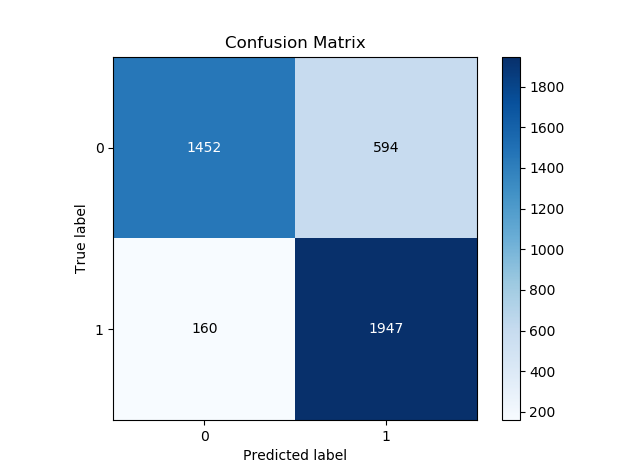
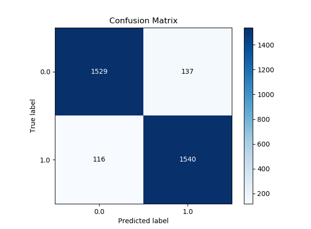
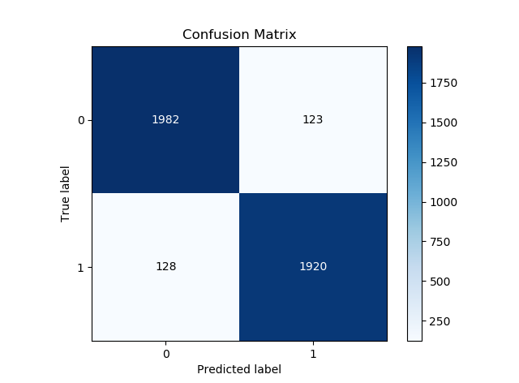

# Fake News Detection

## Overview  
The topic of fake news detection on social media has recently attracted tremendous attention. The basic countermeasure of comparing websites against a list of labeled fake news sources is inflexible, and so a machine learning approach is desirable.  Our project aims to use Natural Language Processing to detect fake news directly, based on the text content of news articles. 

## Problem Definition
Develop a machine learning program to identify when a news source may be producing fake news. We aim to use a corpus of labeled real and fake new articles to build a classifier that can make decisions about information based on the content from the corpus. The model will focus on identifying fake news sources, based on multiple articles originating from a source.  Once a source is labeled as a producer of fake news, we can predict with high confidence that any future articles from that source will also be fake news.  Focusing on sources widens our article misclassification tolerance, because we will have multiple data points coming from each source.  

The intended application of the project is for use in applying visibility weights in social media.  Using weights produced by this model, social networks can make stories which are highly likely to be fake news less visible.

## Dataset Description

* train.csv: A full training dataset with the following attributes:
  * id: unique id for a news article
  * title: the title of a news article
  * author: author of the news article
  * text: the text of the article; could be incomplete
  * label: a label that marks the article as potentially unreliable
    * 1: unreliable
    * 0: reliable

* test.csv: A testing training dataset with all the same attributes at train.csv without the label.

## File Structure
The file structure is the following

```
.
|
+-- datasets
|   +-- train.csv
|   +-- test.csv
+-- images
|   +-- svm-cm.png
|   +-- naive-bayes-cm.png
|   +-- neural-net-tf.png
|   +-- neural-net-keras.png
|   +-- lstm-cm.png
+-- *.py
```

## Try It Out

1. Clone the repo to your local machine-  
`> git clone git://github.com/FakeNewsDetection/FakeBuster.git`  
`> cd FakeBuster`

2. Make sure you have all the dependencies installed-  
 * python 3.6+
 * numpy
 * tensorflow
 * gensim
 * pandas
 * keras
 * matplotlib
 * scikitplot
 * sklearn
 * nltk
   * For nltk, we recommend typing `python.exe` in your command line which will take you to the Python interpretor.  
     * Then, enter-
       * `>>> import nltk`
       * `>>> nltk.download()`
    
3. You're good to go now-  
`> python svm.py`

## Comparing Accuracies of Models

| Model                     | Accuracy     |
|:-------------------------:|:------------:|
| Naive Bayes               | 72.94%       |
| SVM                       | 88.42%       |
| Neural Network with TF    | 81.42%       |
| Neural Network with Keras | 92.62%       |
| LSTM                      | 94.53%       |

## Confusion Matrices

* Naive Bayes



* SVM



* Neural Network with TensorFlow



* Neural Network with Keras



* LSTM



## References
  * [Fake news detection: A Data Mining perspective](https://arxiv.org/pdf/1708.01967.pdf)
  * [Fake News Identification - Stanford CS229](http://cs229.stanford.edu/proj2017/final-reports/5244348.pdf)
  * [B.S. Detector](https://github.com/bs-detector/bs-detector)
  * [Datasets from Kaggle](https://www.kaggle.com/c/fake-news/data)
